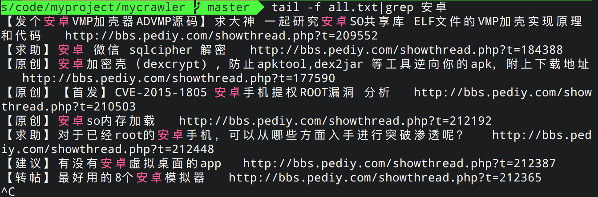

# mycrawler
 A series of crawlers written in py which make my life more comfortable  

## Overview
- `yinwang_blog_reminder.py`  
Whatever Yinwang publish or delete one or more blog,you can always get to be known
by the Email you set.

- `pediy_crawler.py`  
A crawler for the bbs of pediy's Android security forum,also you can modify the URL to crawl other forums.

## Prerequisite 
Execute the command below to solve the dependency:  
`sudo pip install -r requirement.txt`  
Whether for some personal reasons or others,it is very highly recommended to leverage the advantage of `virtualenv` to avoid some unnecessary pain from your local python environment.Just now,one of my colleagues encountered a strange problem then I fix it by using the virtualenv.

## Configuration & Notice 
You need to create a file named `config.py` with three required fields of `sender` `receiver` and `pwd`.Their data type is all the String.And it's also important to know that not one of them can be dispensed with.The value of sender and receiver are the respective Email address as their literal meaning representing. First of all,for the field of a sender,I use the Email service provider of 126.com as the sender.And all about the sender you should know is that you need to allow the POP3/SMTP/IMAP service in the system setting page and remember the URL of the SMTP server such as smtp.126.com.Next,about the field of receiver mentioned above,it is:  
```
A list of addresses to send this mail to. A bare string will be treated as a list with 1 address.
```
which means I think that if you have several friends that need to receive the message from you,the field of receiver's data type should be a List with String.Finally,the field of `pwd` is an auth code for mail.126.com in this circumstance for me.

## Usage
Once all steps above you have done,just run one of the scripts which show in this repo to wait lots of 1s to see what will happen.
- `yinwang_blog_reminder.py`   
You'd better to resort to a small tool named `cron` to run this crawler.For more
detailed,see this [commit message]("https://github.com/supersu097/mycrawler/commit/57c4bcd49da88f1c5cda615995acd88013835ece").

- `pediy_crawler.py`
```
usage: pediy_crawler.py [-h] -a

A crawler for the bbs of pediy's Android security forum,also you can modify
the url to crawl other forum.

optional arguments:
  -h, --help  show this help message and exit
  -a, --all   Get all threads and tagged threads of 优秀,精华 and 关注
```

## Tips
- `pediy_crawler.py`  
You can issue the command of `tail -f all.txt |grep your-keywords` to filter
what you wanna watch.And the filename of `all_tagged.txt` stores all of the thread with one of the tags mentioned in the usage above.  
The final demo effect is shown as below:  

